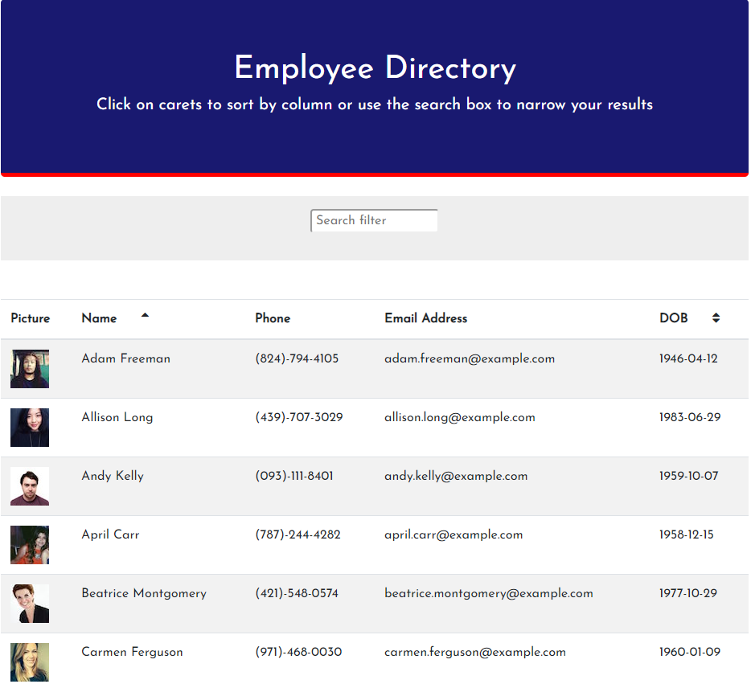

# User Directory

This application uses React.js to display an employee directory.   

 
This application is deployed on [Heroku](https://secret-sea-93788.herokuapp.com/)

You can filter which users are shown by typing a string in the search field - with each character typed the list of names displayed changes to show you just names that match the string.  Spaces are counted as well, for example, if your list contains "John Doe", "John Sanders", and "John Stone", if you type "John S" in the search bar the final two "Johns" will be displayed.  

You can sort the employees by their first name by clicking on the sort icon in the header of the Name column, and by birth date by clicking on the sort icon in the header of the DOB column.   

## Implementation details

The list of users for the sample application are obtained dynamically from a public API [here](https://randomuser.me/api/?results=20&nat=us). You can easily change the query to return more or fewer users by modifying the value in the results parameter in the call.  To use your own data, modify the function getEmployees in EmployeeTable.js.  
